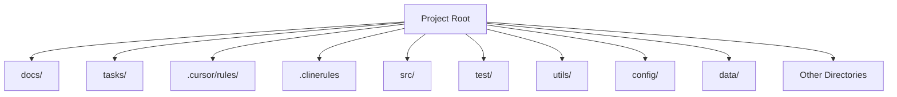

# directory-structure

> directory structure to follow

## Usage

Add this to your project's CLAUDE.md to activate this skill:

```
Read and follow the instructions in .claude/skills/directory-structure/SKILL.md
```

Or copy the instructions below directly into your CLAUDE.md:

---
description: the top-level directory structure for the project
globs: 
alwaysApply: false
---     
# Directory Structure


---
> Source: [Bhartendu-Kumar/rules_template](https://github.com/Bhartendu-Kumar/rules_template) — distributed by [TomeVault](https://tomevault.io).
<!-- tomevault:4.0:claude_md:2026-05-18 -->
